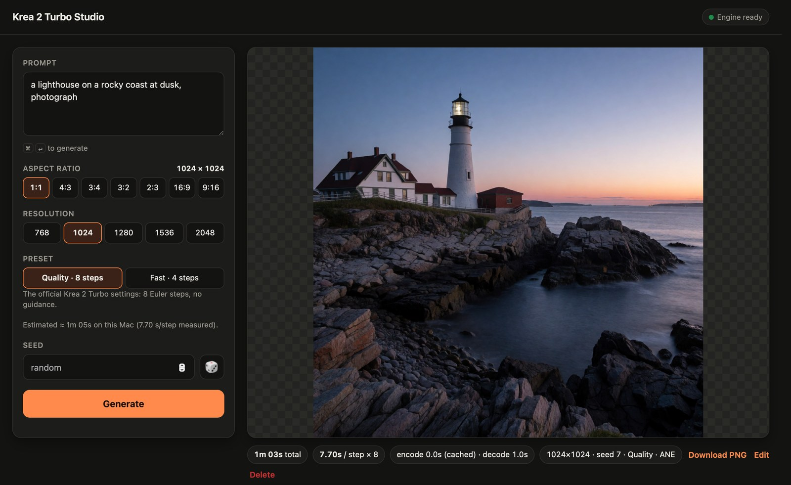
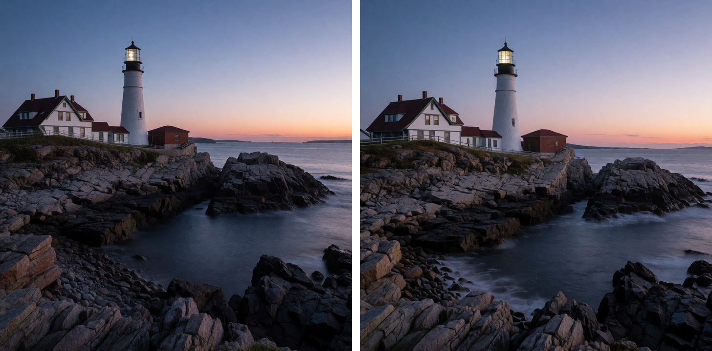
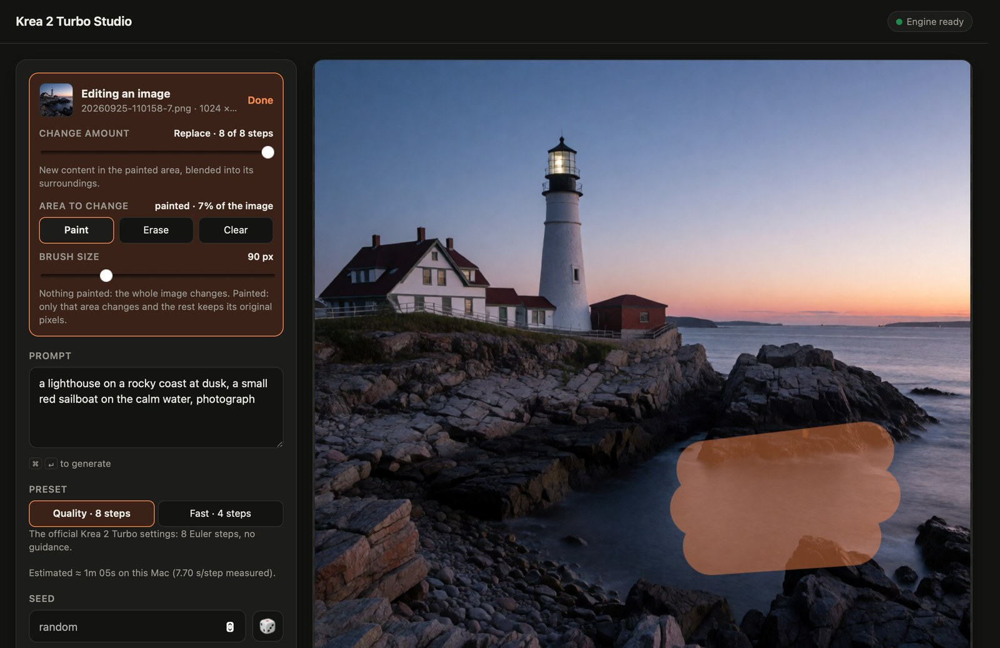

<p align="center">
  
</p>

<h1 align="center">Krea 2 Turbo Studio</h1>

<p align="center">
  <b>Krea 2 image generation, native on your Mac.</b><br>
  A hand-written Metal + Neural Engine engine for Krea 2 Turbo. About a minute per 1024×1024 image, 33 seconds in Fast mode, entirely offline.
</p>

<p align="center">
  
  
  
  
</p>

<p align="center">
  <a href="#install">Install</a> ·
  <a href="#quickstart">Quickstart</a> ·
  <a href="#features">Features</a> ·
  <a href="#performance">Performance</a> ·
  <a href="#how-it-works">How it works</a> ·
  <a href="#faq">FAQ</a>
</p>

<p align="center">
  
</p>

> Krea 2 Turbo is a 12-billion-parameter image model. Generic runtimes treat a Mac like a small GPU box, and a model
> this size crawls there. Krea 2 Turbo Studio is built for this one model on this one kind of machine. Every kernel
> is written for Krea 2's exact shapes, and every layer is split between the GPU and the Neural Engine, which run at
> the same time. The result is a native Mac app that turns a prompt into a 1024×1024 image in about a minute and
> keeps everything on your machine.

---

## Features

### Fast, private, local
Images are generated on your Mac by the GPU and the Apple Neural Engine working together, with nothing sent anywhere.
On an M3 Pro, a 1024×1024 image takes about a minute at full quality. That's **3.2× faster per step than the same
engine on the GPU alone**.

### Two presets
|  | Steps | 1024×1024 | What it is |
|---|---|---|---|
| **Quality** | 8 | ~1 min | The official Krea 2 Turbo settings |
| **Fast** | 4 | ~33 s | A 4-step distillation LoRA merged into the weights |

<p align="center">
  <br>
  <sub>Same prompt and seed. Left: Quality (8 steps). Right: Fast (4 steps).</sub>
</p>

Only one preset's weights are in memory at a time, since two would not fit. Switching restarts the engine with the
other preset in about 20 seconds and picks your queued image back up automatically.

### Edit your images
Open any image from your gallery, change the prompt, and choose how much should change, from a light touch-up to a
bold reinterpretation. Paint over an area to change **only that area**: everything outside it keeps its original
pixels, with a soft seam where the two meet.

<p align="center">
  
</p>

Krea 2 has no instruction-based editing mode (it was released as a text-to-image model), so edits work by
re-imagining the image with your prompt, which is the image-to-image and inpainting approach every diffusion model
supports.

<sub>Edits change what's already in the image; adding new objects usually doesn't work.</sub>

### Watch it paint
A live preview updates after every step, with a full-quality decode halfway through, so you can cancel early if the
composition isn't what you wanted.

### A real Mac app
- **KreaImage.app**: a native macOS app with a loading screen, an outputs folder and a server log. Quit it and every
  byte of the model's memory is released.
- **Web UI** at `http://127.0.0.1:7861` for your browser.
- **CLI** for scripts and batch runs.

### Made to be a good citizen
- **Prompt cache:** repeating a prompt skips the text encoder, in memory and on disk.
- **Memory guard:** the engine checks macOS's locked-memory headroom before it loads. If another large model app is
  running, it tells you instead of pushing the Mac over the edge.
- **Settings sidecars:** every image is saved as a PNG next to a JSON file with its prompt, seed, preset and timings.
- **Content-filter hook:** a prompt blocklist, stored as hashes, where you can plug in your own classifier. The Krea 2
  license asks deployers to filter content.

---

## Performance

Measured on a MacBook Pro with an **M3 Pro** (14-core GPU, 16-core Neural Engine, 36 GB), macOS 14.4, on AC power
with Low Power Mode off. Timings vary by about ±10% between sessions.

| 1024×1024 | Time |
|---|---|
| Quality, 8 steps (prompt cached) | **62–65 s** per image (7.4–7.9 s/step) |
| Fast, 4 steps (prompt cached) | **33 s** per image (7.7 s/step) |
| A new prompt (text encoder) | +3–4 s, then cached |
| Image decode (VAE) | 1.0–2.1 s |
| Same engine, GPU only | 24.6 s/step (sum of measured per-op times) |

| Other | |
|---|---|
| 512×512, Quality | 20–23 s per image |
| Engine start | ~20 s. The first launch takes 1.5–2.5 min while macOS compiles the Neural Engine programs, then they're cached |
| Switching presets | ~20 s (cached programs) |
| Memory while loaded | ~17 GB locked (~21.5 GB at the peak, while loading), plus ~2 GB other |

**Accuracy.** Every stage was checked against an fp32 PyTorch implementation of the official Krea 2 code:

| Stage | Difference |
|---|---|
| Text encoder + fusion | 0.34% (relative L2) |
| One DiT forward pass, 1024² | 1.56% |
| Each denoising step on the reference trajectory, 512² | 0.8–1.7% (Quality), 0.6–2.8% (Fast) |
| Image decoder | 0.27/255 mean absolute error |
| Image encoder (editing) | 0.41% |

Over a whole 8-step run these small differences add up, as they would for any implementation: the model amplifies a
0.01% change in its input about 160-fold. So a given seed gives the same scene with slightly different details, not
a pixel-identical image.

> Not yet measured: head-to-head timings against other Mac runtimes such as mflux and stable-diffusion.cpp.

---

## Install

### Requirements
- An Apple silicon Mac with **36 GB of unified memory or more** (32 GB may work; see below). Development and
  testing were done on an M3 Pro with 36 GB; other chips are untested.
- **macOS 14** or later.
- **Xcode** (the full app, for the Metal shader compiler), Python 3.12 and [uv](https://github.com/astral-sh/uv).
- **~40 GB of disk** for the converted weights (both presets), plus ~35 GB during setup for the original checkpoints,
  which you can delete afterwards.
- A Hugging Face account. Krea 2's weights are released under the **Krea 2 Community License**: read and accept it on
  the [model page](https://huggingface.co/krea/Krea-2-Turbo) before downloading. This project doesn't redistribute
  any weights.

### How much memory do I need?
The engine keeps about 17 GB of model weights locked in memory while it generates (about 21.5 GB at the peak, while
loading), plus about 2 GB for everything else. macOS lets apps lock only part of the RAM: about 79%, or 30.5 GB on a
36 GB Mac.

| Unified memory | |
|---|---|
| 48 GB or more | Comfortable, even with other apps open |
| 36 GB | Works (tested on an M3 Pro); keep other heavy apps closed |
| 32 GB | Should work with other apps closed, with heavy swapping (untested estimate) |
| 24 GB or less | Not supported: the engine needs more locked memory than macOS allows, so the app declines to load instead of risking a crash |

### Build from source
```bash
git clone https://github.com/shinoss/krea_image && cd krea_image
uv venv .venv --python 3.12
uv pip install --python .venv/bin/python -r requirements.txt
```

Download the original checkpoints (about 35 GB) into `weights/src`:
```bash
export PATH="$PWD/.venv/bin:$PATH"
hf auth login   # after accepting the Krea 2 Community License on the model page
hf download Comfy-Org/Krea-2 diffusion_models/krea2_turbo_bf16.safetensors --local-dir weights/src
hf download lvladikov/Krea2-Turbo-Distill-4step-LoRA krea2_turbo_4step_rank_64_lora.safetensors --local-dir weights/src/lora
hf download Qwen/Qwen-Image vae/config.json vae/diffusion_pytorch_model.safetensors --local-dir weights/src/qwen-image
hf download unsloth/Krea-2-Turbo tokenizer/tokenizer.json tokenizer/tokenizer_config.json tokenizer/chat_template.jinja model_index.json scheduler/scheduler_config.json transformer/config.json text_encoder/config.json --local-dir weights/src/krea2
hf download Qwen/Qwen3-VL-4B-Instruct config.json model.safetensors.index.json --local-dir weights/src/qwen3vl
python tools/fetch_te.py
```
`fetch_te.py` range-reads only the 35 text-encoder layers Krea 2 uses (7.8 GB), not the whole vision-language model.

Then build everything in one go: weight conversion, the Neural Engine programs for both presets, the live-preview
calibration, and the app, which lands in `/Applications`.
```bash
./run.sh setup
```

---

## Quickstart

**App.** Open **KreaImage** from `/Applications`. Type a prompt, pick an aspect ratio, resolution and preset, and
press **Generate** (or ⌘↵). Images are saved to `outputs/` next to a JSON file with their settings.

**Web UI.**
```bash
./run.sh
```
Then open [http://127.0.0.1:7861](http://127.0.0.1:7861).

**CLI.**
```bash
.venv/bin/python tools/generate.py "a red fox asleep in fresh snow at dawn" -o fox.png
.venv/bin/python tools/generate.py "a lighthouse at dusk" --preset fast --size 1280 --seed 7 --json
```

---

## How it works

```
 prompt ──► Qwen3-VL-4B text encoder (layers 0–34) ──► TextFusion + txtmlp ──►  text tokens   (cached per prompt)
                                                                                   │
 noise ───────────────────────────────────────────────────────────────────────►  DiT × 28 blocks, 8 or 4 steps
                                                                                   │
                  ┌──────────────────── every block, pipelined in 1,152-row chunks ────────────────────┐
                  │  GPU (Metal)                              Neural Engine (Core ML, int8)              │
                  │  K/V projection · attention               Q/gate projection                          │
                  │  3,072 of 16,384 MLP units                the other 13,312 MLP units                 │
                  │  last chunk's output projection           the other chunks' output projections       │
                  └──────────────────────────────────────────────────────────────────────────────────────┘
                                                                                   │
                                                                     Qwen-Image VAE decoder (Metal) ──► image
```

- **Shape-specialized Metal kernels:** a bf16 GEMM with fp32 accumulation at ~4.7 TFLOPS (close to the M3 Pro GPU's
  peak), flash attention with Krea 2's sigmoid output gate fused in, fused RMSNorm and QK-norm + 3-axis RoPE,
  and implicit-GEMM and Winograd convolutions for the VAE.
- **GPU + Neural Engine in parallel:** each block's linear layers are split between the two processors. Attention of
  a chunk needs every chunk's keys and values but only its own queries, so the GPU produces K/V and the Neural Engine
  produces Q, and chunks flow across block boundaries without waiting. Handoffs use `MTLSharedEvent`s and zero-copy
  IOSurface buffers shared by Metal and Core ML.
- **Neural Engine programs** are 1×1-convolution Core ML models with per-channel int8 weights. Long reductions are
  split into slices, which makes the ANE ~1.4–1.9× faster than one big convolution.
- **Memory:** the text encoder's weights are streamed from disk for each new prompt and never stay resident. The DiT's
  weights are locked in memory once, so the first image isn't slowed by page faults.
- **Precision where it matters:** the residual stream is fp32, and block 0 carries one head dimension with an extreme
  QK-norm gain in fp32 through the attention scores.

---

## FAQ

**The app says "not enough memory to load the engine".**
Another app is holding a lot of memory that can't be paged out, typically another local image or LLM app. Quit it,
then choose **Engine → Restart Engine** (⌘⇧R).

**The first launch is slow.**
On first use macOS compiles 84 Neural Engine programs per preset, which takes 1.5–2.5 minutes. They're cached, so
later launches take about 20 seconds.

**Why does switching between Quality and Fast take ~20 seconds?**
Each preset is a separate ~16 GB set of weights, and both don't fit in memory at once. Switching releases one set,
then loads the other.

**Can I describe an edit, like "remove the boat"?**
Not directly: Krea 2 has no instruction-editing mode. Paint over the boat, describe the scene without it, and set the
amount to *Replace*.

**Where are my images?**
In `outputs/` in the project folder (**Engine → Open Outputs Folder** in the app). Each PNG has a JSON file with its
settings next to it.

---

## Project layout
```
app/        KreaImage.app (SwiftUI shell around the web UI) and its build script
engine/     the engine: Metal kernels (kernels/) and the Objective-C++ runtime (src/), built with make
ui/         web server, Python bindings, content-filter hook, and the web UI (static/)
tools/      weight download, conversion and Neural Engine program builders, preview calibration, CLI
run.sh      setup and launcher
```

## Acknowledgments
- [Krea](https://www.krea.ai) for Krea 2 Turbo.
- [Qwen](https://huggingface.co/Qwen) for Qwen3-VL (the text encoder) and the Qwen-Image VAE.
- [lvladikov](https://huggingface.co/lvladikov/Krea2-Turbo-Distill-4step-LoRA) for the 4-step distillation LoRA
  behind Fast mode.
- [Comfy-Org](https://huggingface.co/Comfy-Org/Krea-2) and [unsloth](https://huggingface.co/unsloth/Krea-2-Turbo)
  for the packaged checkpoint and tokenizer files.

## License
Licensed under the **Krea 2 Community License Agreement**, the same license as Krea 2 Turbo; see
[LICENSE.md](LICENSE.md). Use of the model is also subject to Krea's
[Acceptable Use Policy](https://www.krea.ai/krea-2-use-policy).
